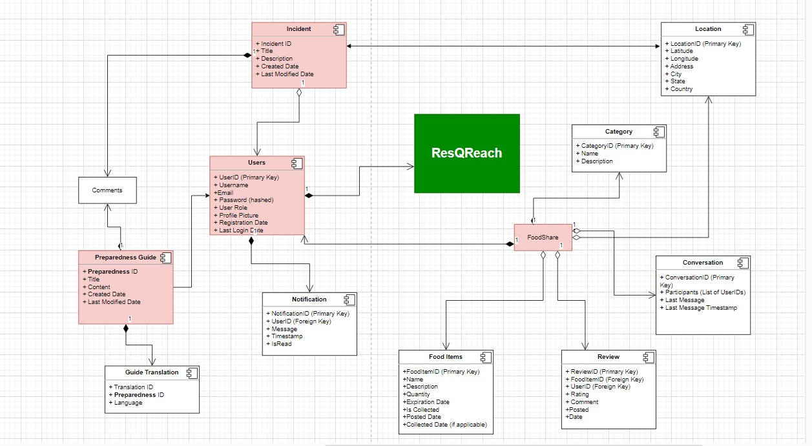

# ResQReach

## Introduction
ResQReach is a Progressive Web Application aimed at enhancing disaster response and preparedness through active community engagement. This application empowers users to report emergencies, access preparedness resources and facilitate sharing of leftover food from restaurants, thus playing a crucial role in crisis management.

## Features

### Emergency Reporting System
- Users can report emergencies or hazards in real-time.
- Upload facility for photos, videos, and detailed descriptions.

### Disaster Preparedness Guides
- Comprehensive educational material for preparing for various natural disasters.
- Guide translations available to make the material diversified
- Enable users to educate each other through comment platform

### Food Share Functionality
- Facilitates the sharing of leftover food from restaurants.
- Allows restaurant owners to post available leftover food.
- Users can browse these postings to find and claim what they need.

### Real-Time Alerts and Notifications
- Push notifications for weather emergency incidents, resource updations and updates regarding food availability.

### Enhancing Community Safety and Well-Being
- A robust system that culminates societal welfare through rescue operations and resource distribution.

### User Reviews
- User reviews provide invaluable insights, offering a firsthand perspective that guides others in making informed decisions.

## Internationalization
- Multilingual content to cater to a diverse user base.

## Impact

### Safety and Response
- Provides real-time information during disasters, potentially saving lives.

### Community Resilience
- Involving the community in preparedness and response to build a more resilient society.

### Resource Optimization
- Efficient coordination of volunteers and resources for a more effective disaster response.

---
## "ResQReach is more than just an application; it's a tool to empower individuals to protect themselves, their families, and their communities before, during, and after disasters, while also addressing the critical issue of food waste through community sharing. Join us in making a difference!"

### Object Model Diagram for ResQReach

